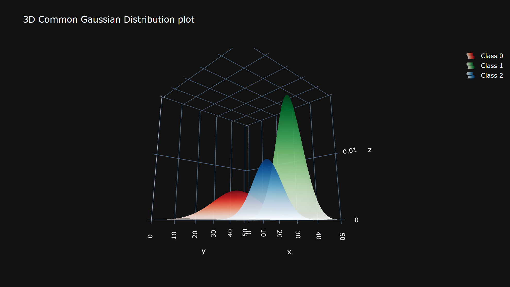
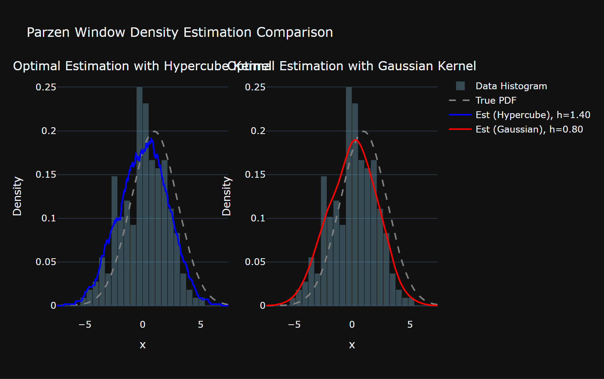
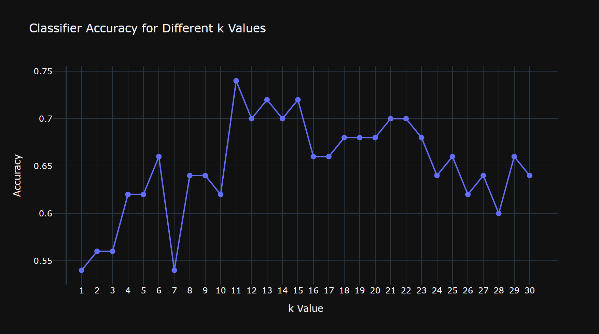
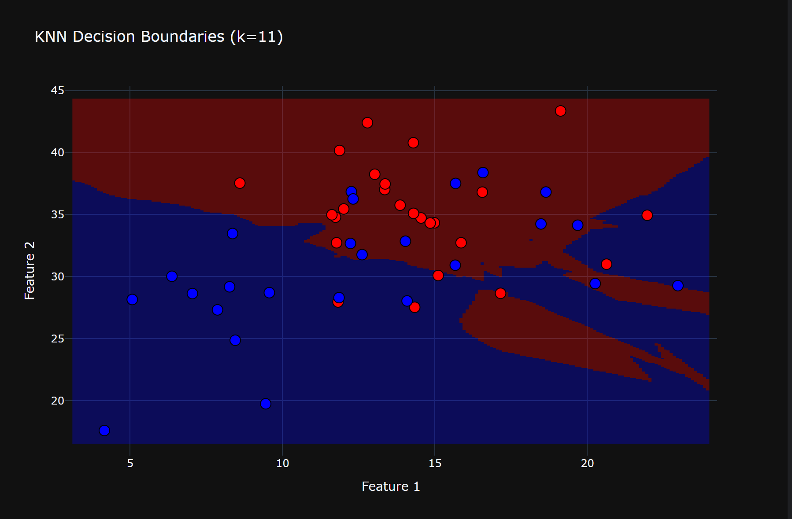
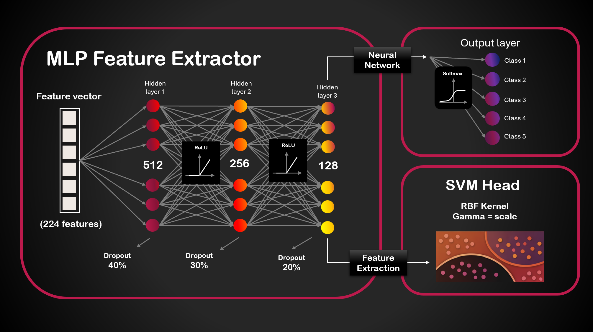
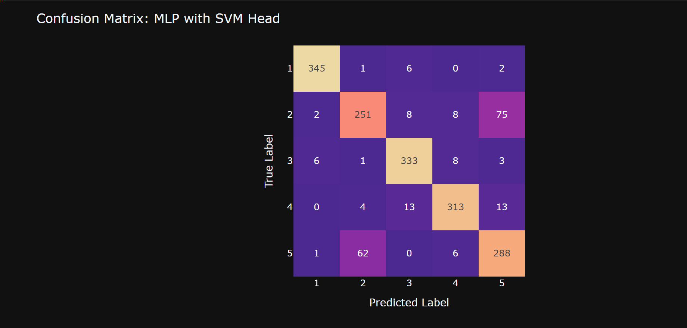
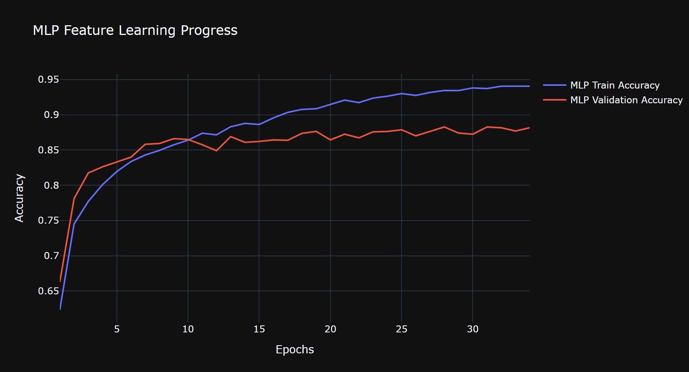

# Pattern Recognition and Machine Learning – Exploratory Project

This project explores fundamental and applied machine learning techniques with an emphasis on understanding the underlying theory and implementing core algorithms from scratch. It deliberately progresses from small, controlled datasets to a real-world classification problem, building intuition before addressing practical complexity.

## Part I: Foundations - Probability Modeling, Density Estimation, and Instance-Based Learning

The first part of the project focuses on three closely related machine learning paradigms: probabilistic modeling, non-parametric density estimation, and instance-based classification. These concepts are explored using small mock datasets that allow full transparency into the mathematical and algorithmic mechanisms involved.

Specifically, the project includes from-scratch implementations of maximum likelihood estimation for Gaussian class modeling, Parzen window density estimation with different kernels and bandwidths, and a k-Nearest Neighbors classifier with probabilistic predictions and decision boundary visualization.

Together, these experiments form a unified learning process that connects theory, implementation, and visualization, reinforcing the importance of understanding machine learning algorithms beyond black-box usage.

<table>
  <tr>
    <td></td>
    <td></td>
  </tr>
  <tr>
    <td></td>
    <td></td>
  </tr>
</table>

## Part II: Applied Machine Learning - Classification and Model Exploration

The second part of the project applies machine learning techniques to a higher-dimensional dataset with thousands of samples and hundreds of features. The task involves designing, training, and evaluating a classification model, with an emphasis on exploring different modeling choices, feature representations, and hyperparameter configurations.

Model selection is guided by empirical evaluation on held-out data, encouraging iterative refinement and critical reasoning about model behavior. This phase bridges theoretical understanding and practical machine learning workflows, reflecting the challenges encountered in real-world data-driven applications.

<table>
  <tr>
    </td>
  </tr>
  <tr>
    <td></td>
    <td></td>
  </tr>
</table>
